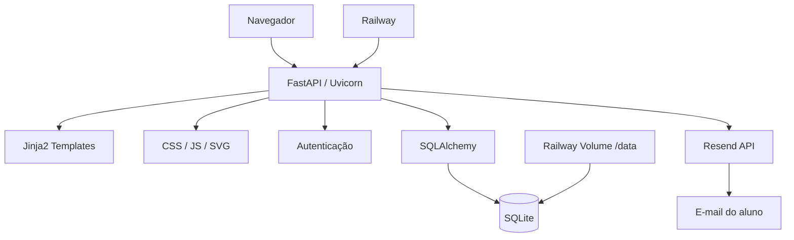

# SPY TEAM

Sistema web para **gestão de assessoria esportiva, alunos, treinos, planejamento semanal e acompanhamento de desempenho**, desenvolvido com **Python, FastAPI, SQLAlchemy, SQLite, Jinja2, HTML, CSS e JavaScript**.

O projeto possui dois perfis principais:

- **Professor**: administra alunos, contas de acesso, treinos base, agendamentos, planejamento semanal e feedbacks.
- **Aluno**: acessa seu painel pessoal, acompanha os treinos da semana, conclui treinos, envia feedback, consulta histórico, gerencia sua senha e recupera o acesso por e-mail.

O SPY TEAM está preparado para rodar localmente e também em produção no **Railway**, com banco SQLite persistente em **Volume**, domínio próprio e envio de e-mails transacionais pelo **Resend**.

---

## Sumário

1. [Visão geral](#1-visão-geral)
2. [Status atual do projeto](#2-status-atual-do-projeto)
3. [Principais funcionalidades](#3-principais-funcionalidades)
4. [Fluxos de uso](#4-fluxos-de-uso)
5. [Tecnologias utilizadas](#5-tecnologias-utilizadas)
6. [Arquitetura](#6-arquitetura)
7. [Estrutura de pastas](#7-estrutura-de-pastas)
8. [Banco de dados](#8-banco-de-dados)
9. [Autenticação e segurança](#9-autenticação-e-segurança)
10. [Sistema de recuperação de senha](#10-sistema-de-recuperação-de-senha)
11. [Sistema de treinos](#11-sistema-de-treinos)
12. [Planejamento semanal](#12-planejamento-semanal)
13. [Frontend e identidade visual](#13-frontend-e-identidade-visual)
14. [Rotas de páginas](#14-rotas-de-páginas)
15. [API](#15-api)
16. [Instalação local](#16-instalação-local)
17. [Variáveis de ambiente](#17-variáveis-de-ambiente)
18. [Execução local](#18-execução-local)
19. [Deploy no Railway](#19-deploy-no-railway)
20. [Banco persistente no Railway](#20-banco-persistente-no-railway)
21. [Domínio próprio](#21-domínio-próprio)
22. [Resend e envio de e-mail](#22-resend-e-envio-de-e-mail)
23. [Git e fluxo de atualização](#23-git-e-fluxo-de-atualização)
24. [Backup e restauração](#24-backup-e-restauração)
25. [Troubleshooting](#25-troubleshooting)
26. [Regras importantes do sistema](#26-regras-importantes-do-sistema)
27. [Limitações atuais e melhorias futuras](#27-limitações-atuais-e-melhorias-futuras)
28. [Checklist de produção](#28-checklist-de-produção)
29. [Referência rápida](#29-referência-rápida)

---

# 1. Visão geral

O **SPY TEAM** foi criado para centralizar o trabalho de uma assessoria esportiva.

Em vez de o professor organizar alunos, treinos e feedbacks manualmente em ferramentas separadas, o sistema concentra essas informações em uma única aplicação web.

A aplicação permite:

- cadastrar alunos;
- criar contas individuais;
- vincular cada aluno a uma ou mais modalidades;
- criar treinos reutilizáveis;
- agendar treinos individuais;
- distribuir treinos automaticamente por modalidade, inclusive para alunos multimodalidade;
- organizar uma semana de segunda a sexta;
- acompanhar conclusão dos treinos;
- receber nota, dificuldade e comentário do aluno;
- manter histórico;
- oferecer recuperação de senha por e-mail;
- operar pela internet com banco persistente.

### Produção

Domínio principal utilizado:

```text
https://www.spyteam.com.br
```

Repositório:

```text
https://github.com/Luanbr01/SpyTeam
```

Branch principal atual:

```text
master
```

## Modalidades oficiais

O SPY TEAM trabalha atualmente somente com:

```text
Corrida
Natação
Musculação
```

Ciclismo e Triathlon foram removidos das opções de cadastro e planejamento.

Um aluno pode possuir **uma, duas ou as três modalidades ao mesmo tempo**. No planejamento semanal, ele recebe automaticamente todos os treinos correspondentes às modalidades vinculadas ao seu cadastro.

Na agenda semanal do aluno, os cards foram simplificados: mostram apenas título, modalidade e status. Ao clicar em um treino, abre-se um modal com a descrição completa, data, ritmo alvo e ação de conclusão.

---

# 2. Status atual do projeto

Atualmente o projeto possui as seguintes áreas implementadas.

## Infraestrutura

- [x] Aplicação FastAPI
- [x] Templates Jinja2
- [x] CSS responsivo
- [x] JavaScript no frontend
- [x] SQLite
- [x] SQLAlchemy ORM
- [x] Deploy no Railway
- [x] Volume persistente
- [x] HTTPS
- [x] Domínio próprio
- [x] Healthcheck
- [x] Variáveis de ambiente
- [x] Envio de e-mail pelo Resend
- [x] Favicon oficial
- [x] Logo vetorial oficial
- [x] Proteção CSRF explícita
- [x] Rate limit no login
- [x] Rate limit global na recuperação de senha
- [x] Invalidação de sessões após troca/redefinição de senha
- [x] Auditoria de logins
- [x] Histórico de alterações administrativas

## Professor

- [x] Login
- [x] Dashboard
- [x] Cadastro de aluno
- [x] Criação automática da conta do aluno
- [x] Listagem de alunos
- [x] Exclusão de aluno
- [x] Criação de treino base
- [x] Edição de treino base
- [x] Exclusão segura de treino base
- [x] Agendamento individual
- [x] Listagem de treinos
- [x] Cópia de treino base
- [x] Reagendamento de treino individual pendente
- [x] Exclusão de agendamento individual pendente
- [x] Planejamento semanal
- [x] Duplicação da semana anterior
- [x] Distribuição por modalidade
- [x] Calendário mensal de treinos
- [x] Visualização de feedbacks

## Aluno

- [x] Login
- [x] Primeiro acesso com cadastro obrigatório de e-mail
- [x] Dashboard pessoal
- [x] Agenda semanal
- [x] Histórico de treinos
- [x] Perfil
- [x] Alteração de senha
- [x] Mostrar/ocultar senha
- [x] Conclusão de treino
- [x] Nota de 1 a 5
- [x] Dificuldade
- [x] Comentário
- [x] Recuperação de senha por e-mail

---

# 3. Principais funcionalidades

## 3.1 Professor

O professor possui acesso administrativo.

Ele pode:

- visualizar o dashboard;
- acompanhar quantidade de alunos;
- visualizar os treinos cadastrados;
- acessar atalhos rápidos de gestão;
- cadastrar alunos;
- definir:
  - nome;
  - nível;
  - uma ou mais modalidades;
  - usuário;
  - senha inicial;
- listar alunos cadastrados;
- abrir os detalhes de cada aluno;
- visualizar os treinos enviados ao aluno;
- visualizar feedbacks;
- excluir alunos;
- criar treinos base;
- editar treinos base;
- copiar um treino base para criar uma nova versão;
- excluir treinos base ainda não utilizados;
- agendar um treino específico para um aluno;
- reagendar um treino individual ainda pendente;
- excluir um agendamento individual ainda pendente sem apagar o treino base;
- montar um planejamento semanal;
- duplicar a semana anterior para a semana selecionada;
- distribuir treinos automaticamente para os alunos da modalidade correspondente;
- consultar o calendário mensal com todos os treinos agendados e seus status.

## 3.2 Aluno

O aluno possui uma conta própria criada pelo professor.

Ele pode:

- fazer login;
- cadastrar o e-mail no primeiro acesso;
- acessar o dashboard;
- visualizar total de treinos;
- visualizar treinos pendentes;
- visualizar treinos concluídos;
- acompanhar a agenda de segunda a sexta;
- concluir um treino;
- atribuir uma nota;
- informar dificuldade;
- escrever um comentário;
- consultar histórico;
- acessar o perfil;
- visualizar:
  - nome;
  - usuário;
  - nível;
  - modalidade;
  - e-mail;
- trocar a própria senha;
- recuperar a senha por e-mail;
- fazer logout.

---

# 4. Fluxos de uso

## 4.1 Cadastro e primeiro acesso do aluno

```text
Professor
   |
   v
Cadastra aluno
   |
   +--> nome
   +--> nível
   +--> modalidade
   +--> usuário
   +--> senha inicial
   |
   v
Conta do aluno criada
   |
   v
Aluno acessa /login
   |
   v
Primeiro login
   |
   v
Sem e-mail cadastrado?
   |
  Sim
   |
   v
/aluno/cadastrar-email
   |
   v
Aluno informa e confirma e-mail
   |
   v
/aluno
```

O cadastro do e-mail é obrigatório antes de acessar a área principal do aluno.

---

## 4.2 Recuperação de senha

```text
Aluno esqueceu a senha
        |
        v
/esqueci-senha
        |
        v
Informa o e-mail cadastrado
        |
        v
SPY TEAM procura a conta
        |
        v
Gera token aleatório
        |
        v
Salva somente o HASH do token
        |
        v
Resend envia o e-mail
        |
        v
Aluno recebe link
        |
        v
/redefinir-senha?token=...
        |
        v
Nova senha + confirmação
        |
        v
Token é invalidado
        |
        v
Login com a nova senha
```

---

## 4.3 Planejamento semanal

```text
Professor escolhe a segunda-feira da semana
                    |
                    v
Define treinos de segunda a sexta
                    |
                    v
Cada treino possui uma modalidade
                    |
                    v
Sistema procura todos os alunos que possuem essa modalidade
                    |
                    v
Cria um TreinoAgendado para cada aluno
                    |
                    v
Aluno visualiza o treino na própria agenda
```

Exemplo:

```text
Treino: Corrida intervalada
Modalidade: Corrida
Dia: Segunda-feira

         |
         v

Todos os alunos que tenham Corrida entre suas modalidades
recebem esse treino, mesmo que também pratiquem Natação ou Musculação.
```

---

# 5. Tecnologias utilizadas

| Tecnologia | Uso |
|---|---|
| Python 3.12 | Backend |
| FastAPI | Framework web e API |
| Uvicorn | Servidor ASGI |
| SQLAlchemy | ORM |
| SQLite | Banco de dados |
| Pydantic | Validação de payloads |
| Jinja2 | Templates HTML |
| HTML5 | Estrutura visual |
| CSS3 | Layout e identidade |
| JavaScript | Interatividade e chamadas Fetch |
| Resend | E-mail transacional |
| Railway | Hospedagem |
| Railway Volume | Persistência do SQLite |
| Registro.br | Administração do domínio |
| Git | Versionamento |
| GitHub | Repositório e integração com deploy |

Dependências atuais:

```text
fastapi
uvicorn
sqlalchemy
pydantic
jinja2
resend
```

O arquivo:

```text
.python-version
```

define:

```text
3.12
```

---

# 6. Arquitetura

A aplicação segue uma estrutura simples de aplicação web server-side com API interna.



## Backend

Localizado em:

```text
app/
```

Responsável por:

- rotas;
- autenticação;
- banco;
- modelos;
- schemas;
- e-mail;
- regras de negócio.

## Frontend

Localizado em:

```text
templates/
static/
```

Responsável por:

- layout;
- formulários;
- dashboard;
- sidebar;
- interações;
- chamadas à API.

---

# 7. Estrutura de pastas

Estrutura relevante atual:

```text
SpyTeam/
│
├── app/
│   ├── __init__.py
│   ├── auth.py
│   ├── database.py
│   ├── email_service.py
│   ├── main.py
│   ├── models.py
│   └── schemas.py
│
├── static/
│   ├── css/
│   │   └── style.css
│   │
│   ├── img/
│   │   ├── logo-spy-team.svg
│   │   ├── logo-spy-team.png
│   │   ├── favicon-spyteam.svg
│   │   ├── favicon-32x32.png
│   │   └── favicon.ico
│   │
│   ├── js/
│   │   ├── aluno.js
│   │   └── security.js
│   │
│   └── deploy-version.txt
│
├── templates/
│   ├── Aluno/
│   │   ├── cadastrar_email.html
│   │   ├── historico.html
│   │   ├── home.html
│   │   └── perfil.html
│   │
│   ├── Professor/
│   │   ├── alunos.html
│   │   ├── home.html
│   │   ├── novo_aluno.html
│   │   ├── planejamento_semanal.html
│   │   ├── seguranca.html
│   │   │
│   │   └── treinos/
│   │       ├── editar_treino_base.html
│   │       ├── novo_treino.html
│   │       ├── novo_treino_base.html
│   │       └── treinos_base.html
│   │
│   ├── componentes/
│   │   ├── sidebar.html
│   │   └── sidebar_aluno.html
│   │
│   ├── esqueci_senha.html
│   ├── login.html
│   └── redefinir_senha.html
│
├── .env.example
├── .gitignore
├── .python-version
├── DEPLOY_RAILWAY.md
├── Procfile
├── README.md
├── requirements.txt
└── assessoria.db
```

### Arquivos de banco que podem existir localmente

Durante o desenvolvimento também podem existir:

```text
assessoria_backup.db
banco_de_dados.db
```

A aplicação atual utiliza **`assessoria.db`**.

Em produção, quando existe Volume Railway, o caminho utilizado é:

```text
/data/assessoria.db
```

---

# 8. Banco de dados

O projeto utiliza **SQLite + SQLAlchemy**.

Arquivo de configuração:

```text
app/database.py
```

## 8.1 Ordem de seleção do banco

O sistema escolhe o banco nesta ordem:

1. `DATABASE_PATH`, caso exista;
2. `RAILWAY_VOLUME_MOUNT_PATH`, caso esteja no Railway;
3. `assessoria.db` na raiz do projeto.

Exemplo local:

```text
SpyTeam/assessoria.db
```

Exemplo Railway:

```text
/data/assessoria.db
```

---

## 8.2 Tabela `alunos`

Modelo:

```text
Aluno
```

Tabela:

```text
alunos
```

| Campo | Tipo | Observação |
|---|---|---|
| id | Integer | Chave primária |
| nome | String | Nome do aluno |
| nivel | String | Iniciante, Intermediário, Avançado etc. |
| modalidade | String | Campo legado com a primeira modalidade, mantido para compatibilidade |

---

## 8.3 Tabela `aluno_modalidades`

Modelo:

```text
AlunoModalidade
```

Tabela:

```text
aluno_modalidades
```

Essa tabela permite que o mesmo aluno tenha várias modalidades. Existe uma restrição única por combinação de aluno + modalidade para evitar vínculos duplicados.

| Campo | Tipo | Observação |
|---|---|---|
| id | Integer | Chave primária |
| aluno_id | Integer | FK para `alunos` |
| modalidade | String | `Corrida`, `Natação` ou `Musculação` |

A coluna antiga `alunos.modalidade` permanece apenas para compatibilidade com versões anteriores. A fonte oficial para distribuição de treinos passa a ser `aluno_modalidades`.

---

## 8.4 Tabela `usuarios`

Modelo:

```text
Usuario
```

Tabela:

```text
usuarios
```

| Campo | Tipo | Observação |
|---|---|---|
| id | Integer | Chave primária |
| usuario | String | Login único |
| senha_hash | String | Hash PBKDF2 |
| tipo | String | `professor` ou `aluno` |
| aluno_id | Integer | FK para `alunos` |
| email | String | E-mail para recuperação |

Características:

- `usuario` é único;
- `aluno_id` é único;
- um usuário aluno é vinculado a exatamente um cadastro de aluno;
- o professor normalmente possui `aluno_id = NULL`;
- o e-mail é opcional inicialmente;
- o aluno cadastra o e-mail no primeiro acesso.

---

## 8.5 Tabela `recuperacoes_senha`

Modelo:

```text
RecuperacaoSenha
```

Tabela:

```text
recuperacoes_senha
```

| Campo | Tipo | Uso |
|---|---|---|
| id | Integer | Chave primária |
| usuario_id | Integer | Dono da recuperação |
| token_hash | String | SHA-256 do token |
| expira_em | Integer | Timestamp de expiração |
| criado_em | Integer | Timestamp de criação |
| usado | Boolean | Invalidação do token |

O token original **não é armazenado**.

---

## 8.6 Tabela `treinos_base`

Modelo:

```text
TreinoBase
```

Tabela:

```text
treinos_base
```

| Campo | Tipo | Uso |
|---|---|---|
| id | Integer | Chave primária |
| titulo | String | Nome do treino |
| modalidade | String | Modalidade |
| descricao | String | Conteúdo do treino |
| ritmo_alvo | String | Opcional |

Treinos base são modelos reutilizáveis.

---

## 8.7 Tabela `treinos_agendados`

Modelo:

```text
TreinoAgendado
```

Tabela:

```text
treinos_agendados
```

| Campo | Tipo | Uso |
|---|---|---|
| id | Integer | Chave primária |
| aluno_id | Integer | Aluno destinatário |
| treino_base_id | Integer | Treino que originou o agendamento |
| titulo | String | Snapshot |
| modalidade | String | Snapshot |
| descricao | String | Snapshot |
| ritmo_alvo | String | Snapshot |
| data_planejada | String | Data ISO |
| concluido | Boolean | Status |
| feedback_nota | Integer | 1 a 5 |
| feedback_comentario | String | Comentário |
| feedback_dificuldade | String | Dificuldade |

### Snapshot

O treino agendado copia:

```text
titulo
modalidade
descricao
ritmo_alvo
```

do treino base no momento do agendamento.

Isso é proposital.

Se o professor editar o `TreinoBase` depois, os treinos que já foram enviados continuam preservando o conteúdo original.

---

## 8.8 Migração leve automática

Ao iniciar, o sistema executa uma migração simples para versões antigas do SQLite.

Atualmente ela:

- verifica as colunas de `usuarios`;
- adiciona `email` se necessário;
- cria índice único case-insensitive para e-mails.

Índice:

```text
ux_usuarios_email_nocase
```

O projeto ainda **não utiliza Alembic**.

---

# 9. Autenticação e segurança

Arquivo:

```text
app/auth.py
```

---

## 9.1 Hash de senha

Senhas não são armazenadas em texto puro.

Algoritmo:

```text
PBKDF2-HMAC-SHA256
```

Iterações:

```text
310000
```

Salt:

```text
16 bytes aleatórios
```

Formato salvo:

```text
ITERACOES$SALT$HASH
```

Exemplo conceitual:

```text
310000$a1b2c3...$9f8e7d...
```

---

## 9.2 Usuário não diferencia maiúsculas/minúsculas

O login é normalizado com:

```python
casefold()
```

Portanto:

```text
Professor
professor
PROFESSOR
PrOfEsSoR
```

são tratados como o mesmo usuário.

---

## 9.3 Espaços no usuário

Espaços internos não são permitidos.

Inválido:

```text
prof essor
luan nascimento
```

Espaços acidentais no início/fim são removidos:

```text
" professor "
```

vira:

```text
professor
```

A senha não recebe essa normalização.

---

## 9.4 Sessão

O sistema utiliza um token assinado armazenado em cookie.

Cookie:

```text
spyteam_session
```

Propriedades:

```text
HttpOnly: true
SameSite: lax
Secure: true em produção
Validade: 1 dia
```

O token inclui:

```text
sub
tipo
ver
exp
```

onde:

- `sub` = ID do usuário;
- `tipo` = aluno/professor;
- `ver` = versão atual da sessão;
- `exp` = timestamp de expiração.

A coluna `usuarios.session_version` começa em `0`. Ao trocar ou redefinir a senha, ela é incrementada. Tokens emitidos com uma versão anterior passam a ser rejeitados imediatamente, invalidando sessões abertas em outros navegadores/dispositivos.

A assinatura utiliza:

```text
HMAC-SHA256
```

com a variável:

```text
SPYTEAM_SECRET
```

---

## 9.5 Proteção por perfil

Dependências principais:

```text
get_current_user
require_professor
require_aluno
require_aluno_com_email
```

### `require_professor`

Bloqueia qualquer conta que não tenha:

```text
tipo = professor
```

### `require_aluno`

Exige:

```text
tipo = aluno
aluno_id != NULL
```

### `require_aluno_com_email`

Além das regras de aluno, exige que o e-mail já tenha sido cadastrado.

---

## 9.6 Produção

No Railway, se não existir:

```text
SPYTEAM_SECRET
```

a aplicação encerra a inicialização.

Isso evita utilizar a chave padrão de desenvolvimento em produção.

---

## 9.7 Proteção CSRF explícita

O projeto utiliza o padrão **double-submit cookie** para operações de escrita.

Cookie CSRF:

```text
spyteam_csrf
```

Cabeçalho exigido:

```text
X-CSRF-Token
```

O arquivo:

```text
static/js/security.js
```

lê o cookie e adiciona automaticamente o cabeçalho em chamadas `POST`, `PUT`, `PATCH` e `DELETE` para `/api/*`.

O middleware do FastAPI compara os dois valores com comparação segura. Uma chamada mutável sem token correspondente recebe `403`. O cookie CSRF não é `HttpOnly` porque precisa ser lido pelo JavaScript, mas usa `SameSite=Lax` e `Secure=true` em produção.

---

## 9.8 Rate limit no login

O login possui proteção contra força bruta baseada no histórico de falhas armazenado no SQLite. Por padrão, a janela é de **15 minutos** e são observados três limites:

```text
30 falhas por IP
5 falhas para a combinação IP + usuário
20 falhas contra o mesmo usuário
```

Tentativas já bloqueadas não prolongam indefinidamente o bloqueio. Quando um limite é atingido, a API retorna `429 Too Many Requests` com `Retry-After`.

As configurações podem ser alteradas por variáveis de ambiente:

```text
LOGIN_RATE_WINDOW_SECONDS
LOGIN_RATE_MAX_IP
LOGIN_RATE_MAX_USER_IP
LOGIN_RATE_MAX_USER
```

---

## 9.9 Rate limit global da recuperação

A recuperação de senha possui três limites simultâneos, também em uma janela padrão de 15 minutos:

```text
10 solicitações por IP
3 solicitações por e-mail/identificador
100 solicitações globais na aplicação
```

O e-mail usado para o controle não é salvo nessa tabela em texto puro; o sistema guarda apenas um **SHA-256 do identificador normalizado**. Solicitações para e-mails inexistentes também contam para o limite, evitando contorno com endereços aleatórios.

Variáveis:

```text
RECOVERY_RATE_WINDOW_SECONDS
RECOVERY_RATE_MAX_IP
RECOVERY_RATE_MAX_IDENTIFIER
RECOVERY_RATE_MAX_GLOBAL
```

---

## 9.10 Auditoria de logins

Cada tentativa de login é registrada em:

```text
auditoria_logins
```

São armazenados:

- usuário informado;
- ID do usuário quando conhecido;
- sucesso ou falha;
- motivo;
- IP;
- user-agent/navegador;
- timestamp.

**A senha nunca é registrada.**

Motivos atuais:

```text
sucesso
credenciais_invalidas
usuario_invalido
rate_limit
```

O professor pode visualizar os eventos em:

```text
/seguranca
```

---

## 9.11 Histórico de alterações administrativas

Mudanças administrativas são registradas em:

```text
auditoria_administrativa
```

O histórico inclui:

- professor responsável;
- ação;
- tipo e ID da entidade;
- descrição;
- detalhes em JSON;
- IP;
- user-agent;
- timestamp.

Ações auditadas atualmente incluem:

```text
criar_aluno
excluir_aluno
agendar_treino
criar_treino_base
editar_treino_base
excluir_treino_base
enviar_treino_em_massa
enviar_planejamento_semanal
```

Senhas e tokens não são colocados no histórico. O registro de auditoria é adicionado à mesma transação da alteração administrativa, evitando registrar como concluída uma mudança que não foi salva no banco.

---

# 10. Sistema de recuperação de senha

O projeto utiliza **Resend** para envio de e-mail.

Arquivo:

```text
app/email_service.py
```

---

## 10.1 Primeiro acesso

Ao primeiro login de um aluno sem e-mail:

```text
/aluno/cadastrar-email
```

é obrigatório.

Enquanto o e-mail não for cadastrado, o aluno não acessa:

```text
/aluno
/aluno/historico
/aluno/perfil
/api/me/treinos
/api/me/senha
```

---

## 10.2 Validação de e-mail

O e-mail:

- é convertido para minúsculas;
- tem espaços externos removidos;
- precisa passar pelo regex de validação;
- precisa ser confirmado duas vezes;
- não pode estar associado a outra conta.

---

## 10.3 Solicitação

Endpoint:

```text
POST /api/senha/esqueci
```

Payload:

```json
{
  "email": "aluno@email.com"
}
```

A resposta pública é sempre genérica:

```text
Se existir uma conta associada a este e-mail,
enviaremos as instruções de recuperação.
```

Isso evita revelar se um endereço possui conta no sistema.

---

## 10.4 Controle de repetição e rate limit

Além do rate limit por IP, identificador e volume global descrito na seção de segurança, existe uma proteção adicional por conta: um novo e-mail de recuperação não é disparado se a última solicitação válida ocorreu há menos de aproximadamente:

```text
60 segundos
```

Isso reduz spam mesmo quando a solicitação ainda está abaixo dos limites globais.

---

## 10.5 Token

O token é gerado com:

```python
secrets.token_urlsafe(32)
```

No banco fica apenas:

```text
SHA-256(token)
```

Validade:

```text
15 minutos
```

Ao gerar um novo token, tokens antigos ainda não utilizados são marcados como usados.

Ao redefinir a senha, os tokens pendentes também são invalidados.

---

## 10.6 Link de recuperação

Formato:

```text
APP_URL/redefinir-senha?token=TOKEN
```

Em produção:

```text
https://www.spyteam.com.br/redefinir-senha?token=...
```

---

## 10.7 Modo de desenvolvimento

É possível testar recuperação sem enviar e-mail real:

```text
EMAIL_MODE=console
```

Nesse modo, o link é impresso no terminal.

---

# 11. Sistema de treinos

## 11.1 Treino base

Um treino base possui:

```text
Título
Modalidade
Descrição
Ritmo alvo opcional
```

Exemplo:

```text
Título: Intervalado 5x1 km
Modalidade: Corrida
Descrição: 10 min aquecimento + 5x1 km...
Ritmo alvo: 4:30 min/km
```

---

## 11.2 Agendamento individual

O professor seleciona:

```text
Aluno
Treino base
Data planejada
```

O sistema cria um `TreinoAgendado`.

---

## 11.3 Treino em massa

Endpoint:

```text
POST /api/treinos/em-massa
```

No estado atual, essa rota distribui o treino informado para **todos os alunos cadastrados**.

A distribuição específica por modalidade é feita pelo recurso de **planejamento semanal**.

---

## 11.4 Edição de treino base

É permitido editar:

- título;
- modalidade;
- descrição;
- ritmo alvo.

Treinos já agendados não mudam porque possuem snapshot.

---

## 11.5 Exclusão de treino base

Um treino base só pode ser excluído se ainda não tiver sido usado em nenhum agendamento.

Se existir um `TreinoAgendado` referenciando o treino base, a API retorna erro.

---

## 11.6 Conclusão

O aluno conclui através de:

```text
PATCH /api/treinos/{treino_id}/concluir
```

O sistema valida que o treino pertence ao aluno autenticado.

Também impede concluir novamente um treino já finalizado.

---

## 11.7 Feedback

Ao concluir, o aluno informa:

```text
nota
dificuldade
comentario
```

A nota deve estar entre:

```text
1 e 5
```

---

## 11.8 Copiar treino base

O professor pode criar uma cópia de um treino base já existente por meio de:

```text
POST /api/treinos-base/{treino_base_id}/copiar
```

A cópia mantém:

```text
Modalidade
Descrição
Ritmo alvo
```

O título recebe automaticamente:

```text
- cópia
```

Exemplo:

```text
Treino original:
Intervalado 5x1 km

Nova cópia:
Intervalado 5x1 km - cópia
```

Depois disso, a cópia é um novo treino base independente e pode ser editada normalmente sem alterar o treino original.

A ação também é registrada no histórico administrativo.

---

## 11.9 Reagendar treino individual

Um treino agendado ainda pendente pode ter a data alterada sem precisar ser excluído e criado novamente.

Endpoint:

```text
PATCH /api/treinos/{treino_id}/reagendar
```

Exemplo:

```json
{
  "data_planejada": "2026-09-28"
}
```

Regras:

- somente o professor pode reagendar;
- treino já concluído não pode ser reagendado;
- o sistema impede que o mesmo aluno receba o mesmo treino base duas vezes na mesma data;
- a alteração é registrada no histórico administrativo;
- o aluno recebe uma nova notificação push informando a nova data.

Ao tocar na notificação, o aluno é direcionado para o treino correspondente.

---

## 11.10 Excluir agendamento individual

O professor pode remover apenas um agendamento específico de um aluno.

Endpoint:

```text
DELETE /api/treinos/{treino_id}
```

Essa ação:

- remove somente o `TreinoAgendado`;
- não exclui o treino base;
- não afeta os agendamentos de outros alunos;
- registra a exclusão no histórico administrativo.

Treinos já concluídos não podem ser excluídos. Eles são preservados no histórico do aluno.

---

## 11.11 Calendário mensal

O professor possui uma visão mensal dos treinos em:

```text
/calendario
```

A página consulta:

```text
GET /api/calendario?ano=AAAA&mes=MM
```

Exemplo:

```text
GET /api/calendario?ano=2026&mes=9
```

O calendário mostra os treinos organizados por dia e permite visualizar:

- título do treino;
- modalidade;
- aluno;
- quantidade de treinos no dia;
- quantidade de pendentes;
- quantidade de concluídos.

Cada dia pode ser aberto para visualizar a lista completa de treinos daquele dia.

O calendário também permite navegar entre os meses e acessar rapidamente o planejamento semanal.

---

# 12. Planejamento semanal

Rota:

```text
POST /api/treinos/semana
```

O parâmetro:

```text
data_segunda
```

precisa representar uma segunda-feira.

Os dias utilizam:

```text
0 = segunda
1 = terça
2 = quarta
3 = quinta
4 = sexta
```

Somente segunda a sexta são aceitos.

---

## 12.1 Modalidades

A comparação de modalidades ignora:

- maiúsculas/minúsculas;
- acentos;
- espaços externos.

Por exemplo:

```text
Corrida
corrida
CORRIDA
```

são equivalentes.

E:

```text
Natação
natacao
```

também são comparáveis pela normalização usada no backend.

---

## 12.2 Evitar duplicidade

Antes de criar o treino, o sistema verifica:

```text
aluno_id
treino_base_id
data_planejada
```

Se a mesma combinação já existir, o treino não é criado novamente.

---

## 12.3 Duplicar semana anterior

Na tela de planejamento semanal existe o botão:

```text
Duplicar semana anterior
```

O professor seleciona a segunda-feira da semana de destino. O sistema calcula automaticamente a segunda-feira da semana anterior e solicita confirmação.

Endpoint:

```text
POST /api/treinos/semana/duplicar
```

Exemplo de requisição:

```json
{
  "origem_segunda": "2026-09-21",
  "destino_segunda": "2026-09-28"
}
```

Regras:

- origem e destino precisam ser segundas-feiras;
- origem e destino precisam ser semanas diferentes;
- a semana de origem precisa possuir treinos;
- são considerados os treinos de segunda a sexta;
- o sistema reconstrói o planejamento por dia e treino base;
- a distribuição da nova semana respeita as modalidades atuais dos alunos;
- agendamentos idênticos que já existirem no destino não são duplicados;
- a ação é registrada no histórico administrativo;
- cada aluno que receber novos treinos recebe uma notificação push resumida.

Exemplo:

```text
Semana 21/09 a 25/09
        ↓ duplicar
Semana 28/09 a 02/10
```

Os treinos mantêm a mesma posição relativa na semana.

---

# 13. Frontend e identidade visual

## 13.1 Identidade

Cores principais:

```text
Primária:        #3161CA
Primária escura: #24499C
Destaque:        #57C0FF
Navy:            #08152F
Fundo:           #F5F8FF
Branco:          #FFFFFF
Texto principal: #101828
Texto secundário:#667085
Muted:           #98A2B3
Borda:           #D9E2F2
```

Semânticas:

```text
Sucesso: #22C55E
Alerta:  #F59E0B
Erro:    #EF4444
```

---

## 13.2 Tipografia

Fonte principal:

```text
Inter
```

Fallback:

```text
system-ui
-apple-system
BlinkMacSystemFont
Segoe UI
sans-serif
```

A fonte Inter é carregada pelo Google Fonts.

---

## 13.3 Logo

Logo principal:

```text
static/img/logo-spy-team.svg
```

Também existe versão PNG:

```text
static/img/logo-spy-team.png
```

---

## 13.4 Favicon

O navegador utiliza somente o símbolo da marca para manter legibilidade em tamanho pequeno.

Arquivos:

```text
static/img/favicon-spyteam.svg
static/img/favicon-32x32.png
static/img/favicon.ico
```

---

## 13.5 Área do professor

Possui:

- sidebar;
- dashboard;
- cards;
- gerenciamento de alunos;
- gerenciamento de treinos;
- planejamento semanal;
- calendário mensal de treinos;
- formulários responsivos.

---

## 13.6 Área do aluno

A área foi dividida em telas distintas:

### Início

```text
/aluno
```

Mostra:

- saudação;
- nível;
- total de treinos;
- pendentes;
- concluídos;
- agenda de segunda a sexta.

### Histórico

```text
/aluno/historico
```

Mostra:

- treinos concluídos;
- modalidade;
- data;
- descrição;
- dificuldade;
- avaliação;
- comentário.

### Meu perfil

```text
/aluno/perfil
```

Mostra:

- nome;
- usuário;
- nível;
- modalidade;
- e-mail;
- alteração de senha.

---

## 13.7 Mostrar senha

O sistema possui botão de olho para mostrar/ocultar senha em:

- login;
- senha atual no perfil;
- nova senha;
- confirmação da nova senha;
- redefinição de senha.

---

# 14. Rotas de páginas

| Método | Rota | Acesso | Página |
|---|---|---|---|
| GET | `/` | Geral | Redirecionamento |
| GET | `/login` | Público | Login |
| GET | `/esqueci-senha` | Público | Solicitação de recuperação |
| GET | `/redefinir-senha` | Público | Nova senha via token |
| GET | `/health` | Público | Healthcheck |
| GET | `/home` | Professor | Dashboard |
| GET | `/novo-aluno` | Professor | Cadastro de aluno |
| GET | `/alunos` | Professor | Gestão de alunos |
| GET | `/novo-treino` | Professor | Agendamento individual |
| GET | `/novo-treino-base` | Professor | Criar treino base |
| GET | `/treinos-base` | Professor | Gerenciar treinos base |
| GET | `/editar-treino-base/{id}` | Professor | Editar treino base |
| GET | `/planejamento-semanal` | Professor | Planejamento semanal |
| GET | `/calendario` | Professor | Calendário mensal dos treinos |
| GET | `/seguranca` | Professor | Segurança, auditoria de logins e alterações |
| GET | `/aluno/cadastrar-email` | Aluno | Primeiro acesso |
| GET | `/aluno` | Aluno com e-mail | Dashboard |
| GET | `/aluno/historico` | Aluno com e-mail | Histórico |
| GET | `/aluno/perfil` | Aluno com e-mail | Perfil |

---

# 15. API

## 15.1 Autenticação e conta

| Método | Endpoint | Acesso | Função |
|---|---|---|---|
| POST | `/api/login` | Público | Login |
| POST | `/api/logout` | Logado | Logout |
| GET | `/api/me` | Logado | Dados da sessão |
| PATCH | `/api/me/email` | Aluno | Primeiro e-mail |
| PATCH | `/api/me/senha` | Aluno com e-mail | Alterar senha |
| POST | `/api/senha/esqueci` | Público | Solicitar recuperação |
| POST | `/api/senha/redefinir` | Público | Redefinir por token |

### Login

```json
{
  "usuario": "professor",
  "senha": "senha"
}
```

Resposta de exemplo:

```json
{
  "mensagem": "Login realizado com sucesso!",
  "tipo": "professor",
  "usuario": "professor",
  "redirect": "/home"
}
```

---

## 15.2 Alunos

| Método | Endpoint | Acesso | Função |
|---|---|---|---|
| POST | `/api/alunos` | Professor | Criar aluno |
| GET | `/api/alunos` | Professor | Listar alunos |
| DELETE | `/api/alunos/{aluno_id}` | Professor | Excluir aluno |
| GET | `/api/alunos/{aluno_id}/treinos` | Professor | Treinos do aluno |

### Criar aluno

```json
{
  "nome": "Aluno Exemplo",
  "nivel": "Intermediário",
  "modalidades": ["Corrida", "Musculação"],
  "usuario": "aluno01",
  "senha": "senha123"
}
```

---

## 15.3 Treinos agendados

| Método | Endpoint | Acesso | Função |
|---|---|---|---|
| POST | `/api/treinos` | Professor | Agendar individual |
| GET | `/api/treinos` | Professor | Listar todos |
| PATCH | `/api/treinos/{treino_id}/reagendar` | Professor | Reagendar treino individual pendente |
| DELETE | `/api/treinos/{treino_id}` | Professor | Excluir agendamento individual pendente |
| POST | `/api/treinos/em-massa` | Professor | Enviar a todos |
| POST | `/api/treinos/semana` | Professor | Planejamento semanal |
| POST | `/api/treinos/semana/duplicar` | Professor | Duplicar uma semana de treinos |
| GET | `/api/calendario` | Professor | Treinos do calendário mensal |
| GET | `/api/me/treinos` | Aluno | Próprios treinos |
| PATCH | `/api/treinos/{treino_id}/concluir` | Aluno | Concluir + feedback |

---

## 15.4 Auditoria de segurança

| Método | Endpoint | Acesso | Função |
|---|---|---|---|
| GET | `/api/auditoria/logins` | Professor | Últimos eventos de login |
| GET | `/api/auditoria/administrativa` | Professor | Histórico de alterações administrativas |

O parâmetro opcional `limite` aceita de 1 a 500 registros.

---

## 15.5 Treinos base

| Método | Endpoint | Acesso | Função |
|---|---|---|---|
| GET | `/api/treinos-base` | Professor | Listar |
| POST | `/api/treinos-base` | Professor | Criar |
| POST | `/api/treinos-base/{id}/copiar` | Professor | Copiar treino base |
| PATCH | `/api/treinos-base/{id}` | Professor | Editar |
| DELETE | `/api/treinos-base/{id}` | Professor | Excluir |

### Criar treino base

```json
{
  "titulo": "Treino intervalado",
  "modalidade": "Corrida",
  "descricao": "10 min de aquecimento...",
  "ritmo_alvo": "4:30 min/km"
}
```

---

# 16. Instalação local

## 16.1 Pré-requisitos

- Python 3.12 recomendado;
- Git;
- VS Code opcional.

Clone:

```bash
git clone https://github.com/Luanbr01/SpyTeam.git
cd SpyTeam
```

---

## 16.2 Ambiente virtual

Windows PowerShell:

```powershell
python -m venv venv
.\venv\Scripts\Activate.ps1
```

CMD:

```cmd
python -m venv venv
venv\Scripts\activate
```

Linux/macOS:

```bash
python3 -m venv venv
source venv/bin/activate
```

---

## 16.3 Dependências

```bash
pip install -r requirements.txt
```

---

# 17. Variáveis de ambiente

Arquivo de referência:

```text
.env.example
```

Não coloque `.env` no GitHub.

---

## 17.1 Autenticação

### `SPYTEAM_SECRET`

Assina as sessões.

Exemplo para gerar:

```bash
python -c "import secrets; print(secrets.token_urlsafe(48))"
```

Obrigatória em produção.

---

### `PROFESSOR_USUARIO`

Usuário criado automaticamente caso não exista nenhum professor.

Exemplo:

```text
professor
```

---

### `PROFESSOR_SENHA`

Senha inicial do professor.

Essa variável é utilizada apenas quando é necessário criar o professor.

Se o professor já existe no banco, mudar essa variável **não muda a senha existente**.

---

### `COOKIE_SECURE`

Produção:

```text
true
```

---

## 17.2 Banco

### `DATABASE_PATH`

Opcional.

Exemplo:

```text
/data/assessoria.db
```

Normalmente não precisa ser definida no Railway porque o sistema detecta:

```text
RAILWAY_VOLUME_MOUNT_PATH
```

automaticamente.

---

## 17.3 E-mail

### `RESEND_API_KEY`

Chave da API do Resend.

```text
re_...
```

Nunca publique essa chave.

---

### `EMAIL_FROM`

Produção atual:

```text
SPY TEAM <noreply@spyteam.com.br>
```

---

### `APP_URL`

Produção atual:

```text
https://www.spyteam.com.br
```

---

### `EMAIL_MODE`

Produção:

```text
resend
```

Desenvolvimento sem envio real:

```text
console
```

---

## 17.4 Rate limits opcionais

Os valores abaixo já possuem defaults no código e só precisam ser configurados se quiser ajustar a política:

```env
LOGIN_RATE_WINDOW_SECONDS=900
LOGIN_RATE_MAX_IP=30
LOGIN_RATE_MAX_USER_IP=5
LOGIN_RATE_MAX_USER=20

RECOVERY_RATE_WINDOW_SECONDS=900
RECOVERY_RATE_MAX_IP=10
RECOVERY_RATE_MAX_IDENTIFIER=3
RECOVERY_RATE_MAX_GLOBAL=100
```

---

## 17.5 Exemplo completo

```env
SPYTEAM_SECRET=gere-uma-chave-longa-e-aleatoria
PROFESSOR_USUARIO=professor
PROFESSOR_SENHA=senha-forte
COOKIE_SECURE=true

RESEND_API_KEY=re_xxxxxxxxxxxxxxxxx
EMAIL_FROM=SPY TEAM <noreply@spyteam.com.br>
APP_URL=https://www.spyteam.com.br
EMAIL_MODE=resend

# Opcional
# DATABASE_PATH=/data/assessoria.db

# Rate limit - opcionais
# LOGIN_RATE_WINDOW_SECONDS=900
# LOGIN_RATE_MAX_IP=30
# LOGIN_RATE_MAX_USER_IP=5
# LOGIN_RATE_MAX_USER=20
# RECOVERY_RATE_WINDOW_SECONDS=900
# RECOVERY_RATE_MAX_IP=10
# RECOVERY_RATE_MAX_IDENTIFIER=3
# RECOVERY_RATE_MAX_GLOBAL=100
```

---

# 18. Execução local

Com o ambiente virtual ativado:

```bash
uvicorn app.main:app --reload
```

Acesse:

```text
http://127.0.0.1:8000
```

Healthcheck:

```text
http://127.0.0.1:8000/health
```

Resposta:

```json
{
  "status": "ok",
  "app": "SpyTeam"
}
```

---

## Professor local padrão

Se não estiver no Railway e não houver professor no banco:

```text
Usuário: professor
Senha: 1234
```

Isso é apenas fallback de desenvolvimento.

Não utilize essa credencial padrão em produção.

---

# 19. Deploy no Railway

O projeto inclui:

```text
Procfile
```

Conteúdo:

```text
web: uvicorn app.main:app --host 0.0.0.0 --port $PORT --proxy-headers --forwarded-allow-ips='*'
```

### Por que `--proxy-headers`?

O Railway funciona atrás de proxy.

Essas opções permitem ao Uvicorn interpretar corretamente informações encaminhadas pelo proxy, inclusive HTTPS.

---

## 19.1 Fluxo

```text
VS Code
   |
   v
git push
   |
   v
GitHub
   |
   v
Railway
   |
   v
Build
   |
   v
Deploy
   |
   v
www.spyteam.com.br
```

---

## 19.2 Healthcheck

Configure:

```text
/health
```

---

# 20. Banco persistente no Railway

O SQLite não deve depender do filesystem temporário do container.

O SPY TEAM utiliza um Railway Volume.

Mount path:

```text
/data
```

Banco:

```text
/data/assessoria.db
```

O `app/database.py` detecta automaticamente:

```text
RAILWAY_VOLUME_MOUNT_PATH
```

---

## 20.1 Railway CLI

Instalação:

```bash
npm install -g @railway/cli
```

Login:

```bash
railway login
```

Vincular projeto:

```bash
railway link
```

---

## 20.2 Ver volumes

```bash
railway volume list
```

---

## 20.3 Ver arquivos

```bash
railway volume files list /
```

Resultado esperado:

```text
assessoria.db
lost+found/
```

---

## 20.4 SSH

```bash
railway ssh
```

Dentro do container:

```bash
echo $RAILWAY_VOLUME_MOUNT_PATH
```

Esperado:

```text
/data
```

Ver banco:

```bash
ls -lh /data
```

---

# 21. Domínio próprio

Domínio atual:

```text
www.spyteam.com.br
```

O domínio está ligado ao Railway através de registros DNS.

No Registro.br, o DNS permanece administrado pelo próprio Registro.br.

O Railway utiliza registros como:

```text
CNAME
TXT de verificação
```

Não publique tokens de verificação DNS em documentação pública.

---

## HTTPS

O Railway emite certificado TLS/SSL após verificar o domínio.

Sempre utilize:

```text
https://www.spyteam.com.br
```

---

# 22. Resend e envio de e-mail

O domínio:

```text
spyteam.com.br
```

é utilizado para envio transacional.

Remetente:

```text
SPY TEAM <noreply@spyteam.com.br>
```

O domínio precisa estar verificado no Resend.

---

## SDK

O projeto utiliza o SDK oficial:

```python
import resend
```

Envio:

```python
resend.Emails.send(...)
```

---

## E-mail enviado

Assunto:

```text
Redefinição de senha - SPY TEAM
```

Conteúdo inclui:

- aviso de recuperação;
- e-mail associado;
- link;
- validade de 15 minutos;
- aviso para ignorar se não tiver solicitado.

---

# 23. Git e fluxo de atualização

Fluxo comum:

```bash
git status
git add .
git commit -m "Descrição da alteração"
git push
```

O Railway recebe as alterações através do GitHub e realiza novo deploy.

---

## Arquivos ignorados

O `.gitignore` atual inclui:

```text
venv/
.venv/
__pycache__/
*.py[cod]
.env
.env.*
!.env.example
*.db
.vscode/
.idea/
.pytest_cache/
.DS_Store
```

Isso evita enviar:

- banco;
- ambiente virtual;
- segredos;
- cache;
- arquivos locais de IDE.

---

# 24. Backup e restauração

## 24.1 Backup local

Antes de alterações delicadas:

```powershell
copy assessoria.db assessoria_backup.db
```

---

## 24.2 Banco de produção

O banco de produção fica no Volume.

Confira:

```bash
railway volume files list /
```

Nunca sobrescreva o banco de produção sem backup.

---

## 24.3 Enviar banco local para o Volume

Quando realmente necessário:

```bash
railway volume files upload ./assessoria.db /assessoria.db
```

Depois reinicie o serviço.

---

# 25. Troubleshooting

## 25.1 `SPYTEAM_SECRET não configurado`

Erro:

```text
RuntimeError: SPYTEAM_SECRET não configurado
```

Solução:

Railway:

```text
Variables
```

adicione:

```text
SPYTEAM_SECRET
```

e faça deploy.

---

## 25.2 CSS não carrega no Railway

Sintoma:

```text
Mixed Content
HTTP stylesheet em página HTTPS
```

Os templates devem usar:

```html
<link rel="stylesheet" href="/static/css/style.css">
```

e não URL absoluta com `http://`.

---

## 25.3 Site está online mas sem domínio

Railway pode mostrar:

```text
Unexposed service
```

Nesse caso:

```text
Settings
→ Networking
→ Public Networking
→ Generate Domain / Custom Domain
```

---

## 25.4 Banco vazio após deploy

Confira:

```bash
railway volume list
```

e:

```bash
railway volume files list /
```

O banco precisa estar no Volume.

---

## 25.5 Login retorna 401

Logs:

```text
POST /api/login 401 Unauthorized
```

Verifique:

- usuário;
- senha;
- banco correto;
- registro da conta no SQLite.

O usuário não diferencia maiúsculas/minúsculas.

---

## 25.6 Usuário contém espaço

Inválido:

```text
joao silva
```

Use:

```text
joaosilva
```

ou outro identificador sem espaços.

---

## 25.7 E-mail não chega

Confira:

```bash
railway logs
```

E também:

```text
Resend → Emails
```

Variáveis necessárias:

```text
EMAIL_MODE=resend
RESEND_API_KEY=...
EMAIL_FROM=...
APP_URL=...
```

---

## 25.8 Favicon antigo continua aparecendo

Favicons possuem cache agressivo.

Tente:

```text
Ctrl + F5
```

ou feche todas as abas e abra novamente.

---

## 25.9 SSL ainda aparece como inseguro

Após alteração de DNS:

- aguarde propagação;
- confirme DNS no Railway;
- teste janela anônima;
- limpe DNS local:

```powershell
ipconfig /flushdns
```

---

# 26. Regras importantes do sistema

## Contas

- professor cria contas de aluno;
- aluno não cria sua própria conta;
- usuário é case-insensitive;
- usuário não aceita espaços internos;
- senha é case-sensitive;
- senha nunca é salva em texto puro.

## E-mail

- aluno cadastra no primeiro acesso;
- e-mail precisa ser único;
- recuperação é destinada a alunos;
- mensagem de recuperação não revela se a conta existe.

## Treinos

- treino base é reutilizável;
- treino base pode ser copiado para gerar uma nova versão independente;
- treino agendado guarda snapshot;
- treino base usado não pode ser excluído;
- agendamento individual pendente pode ser reagendado;
- agendamento individual pendente pode ser excluído sem apagar o treino base;
- treino concluído é preservado no histórico e não pode ser excluído;
- aluno só conclui treino que pertence a ele;
- nota é de 1 a 5;
- planejamento semanal distribui por modalidade;
- semana aceita segunda a sexta;
- semana anterior pode ser duplicada para uma nova semana;
- o calendário mensal é exclusivo do professor.

## Banco

- banco principal local: `assessoria.db`;
- banco de produção: `/data/assessoria.db`;
- `.db` não deve ir ao GitHub.

---

# 27. Limitações atuais e melhorias futuras

O estado atual é funcional, mas há espaço para evolução.

## Banco

SQLite é adequado para o estágio atual.

Para maior número de usuários/conexões simultâneas, considerar:

```text
PostgreSQL
```

---

## Migrações

Atualmente há migrações leves manuais.

Melhoria recomendada:

```text
Alembic
```

---

## Segurança

Implementado:

- [x] rate limit no login;
- [x] rate limit por IP, identificador e volume global na recuperação;
- [x] proteção CSRF explícita;
- [x] invalidação das sessões existentes após troca ou redefinição de senha;
- [x] auditoria de logins;
- [x] histórico de alterações administrativas.

Possíveis evoluções adicionais:

- [ ] política de senha mais forte;
- [ ] autenticação de dois fatores;
- [ ] alertas automáticos para padrões suspeitos;
- [ ] exportação dos relatórios de auditoria;
- [ ] retenção/arquivamento configurável dos logs de auditoria.

---

## Conta

Ainda podem ser adicionados:

- troca de e-mail;
- confirmação/verificação do e-mail;
- recuperação do professor;
- alteração de senha do professor no painel;
- foto de perfil;
- edição de dados pessoais.

---

## Treinos

Melhorias implementadas:

- [x] duplicar a semana anterior para a semana selecionada;
- [x] copiar um treino base para criar uma nova versão;
- [x] excluir um agendamento individual ainda pendente sem apagar o treino base;
- [x] reagendar um treino individual ainda pendente;
- [x] calendário mensal do professor com treinos por dia.

O modelo de treino continua propositalmente simples:

```text
Título
Modalidade
Descrição
Ritmo alvo
```

As melhorias acima atuam sobre organização, reutilização e gerenciamento dos agendamentos, sem adicionar campos extras à estrutura do treino.

---

## Dashboard

Indicadores implementados no painel do professor:

- alunos ativos com atividade nos últimos 7 dias;
- taxa de conclusão no período selecionado;
- aderência média individual dos últimos 30 dias;
- treinos por modalidade;
- frequência semanal de treinos concluídos;
- média e distribuição das avaliações;
- alunos inativos / que precisam de atenção;
- atividade recente;
- gráfico de frequência por semana.

O painel do aluno também foi simplificado e passou a destacar:

- treinos programados na semana;
- concluídos e restantes;
- próximo treino;
- agenda semanal clicável;
- modal com detalhes do treino;
- histórico recente.

---

## Testes

O projeto atualmente não possui uma suíte permanente de testes automatizados dentro de uma pasta `tests/`.

Melhoria recomendada:

```text
pytest
FastAPI TestClient
```

---

# 28. Checklist de produção

Antes de considerar um deploy saudável:

### Aplicação

- [ ] `/health` retorna `200`
- [ ] login professor funciona
- [ ] login aluno funciona
- [ ] logout funciona

### Banco

- [ ] Volume conectado
- [ ] mount path `/data`
- [ ] `assessoria.db` presente
- [ ] dados continuam após restart

### Professor

- [ ] cadastrar aluno
- [ ] listar aluno
- [ ] excluir aluno
- [ ] criar treino base
- [ ] editar treino base
- [ ] copiar treino base
- [ ] agendar treino
- [ ] reagendar treino pendente
- [ ] excluir agendamento pendente
- [ ] planejamento semanal
- [ ] duplicar semana anterior
- [ ] abrir calendário mensal

### Aluno

- [ ] primeiro e-mail
- [ ] dashboard
- [ ] histórico
- [ ] perfil
- [ ] alteração de senha
- [ ] concluir treino
- [ ] feedback

### Recuperação

- [ ] Resend configurado
- [ ] domínio verificado
- [ ] e-mail recebido
- [ ] link abre domínio correto
- [ ] token expira
- [ ] senha nova funciona

### Segurança

- [ ] CSRF bloqueia requisição mutável sem token
- [ ] login registra sucesso/falha na auditoria
- [ ] rate limit retorna 429 após excesso de tentativas
- [ ] alteração de senha desconecta sessões antigas
- [ ] `/seguranca` abre somente para professor
- [ ] alterações administrativas aparecem no histórico

### Visual

- [ ] CSS carregando
- [ ] logo carregando
- [ ] favicon carregando
- [ ] mobile funcionando

---

# 29. Referência rápida

## Iniciar localmente

```bash
uvicorn app.main:app --reload
```

## URL local

```text
http://127.0.0.1:8000
```

## Produção

```text
https://www.spyteam.com.br
```

## Healthcheck

```text
/health
```

## Banco local

```text
assessoria.db
```

## Banco Railway

```text
/data/assessoria.db
```

## E-mail remetente

```text
SPY TEAM <noreply@spyteam.com.br>
```

## Usuário professor de desenvolvimento

```text
professor
```

## Senha professor de desenvolvimento

```text
1234
```

> Apenas quando executado fora do Railway, não existir professor no banco e nenhuma credencial tiver sido configurada.

---

# Observações finais

O SPY TEAM atualmente reúne em uma única aplicação:

- autenticação;
- controle de perfil;
- gestão de alunos;
- organização de modalidades;
- treinos base;
- agendamento;
- planejamento semanal;
- distribuição automática;
- feedback;
- histórico;
- perfil do aluno;
- alteração de senha;
- recuperação de senha;
- e-mail transacional;
- banco persistente;
- deploy contínuo;
- domínio próprio;
- HTTPS;
- identidade visual própria.

A arquitetura atual foi mantida simples para facilitar manutenção e evolução durante o desenvolvimento, sem impedir futuras migrações para componentes mais robustos, como PostgreSQL, Alembic, serviços de fila e uma suíte completa de testes automatizados.


---

## PWA e notificações Web Push

O SPY TEAM também pode ser instalado no celular como **Progressive Web App (PWA)**.
O aluno continua utilizando a mesma aplicação, conta, banco e API do site, mas pode abrir o sistema em modo `standalone`, com ícone próprio na tela inicial.

### Recursos implementados

- manifesto PWA;
- Service Worker com cache somente de arquivos estáticos;
- tela neutra quando o dispositivo está offline;
- ícones 192x192 e 512x512;
- ícone `maskable` para Android;
- suporte ao fluxo de instalação do navegador;
- suporte a Web Push;
- ativação/desativação das notificações pelo perfil do aluno;
- notificação de teste;
- notificação automática quando um treino individual é agendado;
- notificação após envio em massa;
- notificação resumida quando o planejamento semanal gera novos treinos;
- toque na notificação abre o SPY TEAM e pode abrir diretamente o treino individual.

### Configuração do Web Push

Instale as novas dependências:

```bash
pip install -r requirements.txt
```

Gere as chaves VAPID **uma única vez**:

```bash
python scripts/gerar_vapid.py
```

Cadastre no Railway, em **Variables**:

```text
VAPID_PUBLIC_KEY=...
VAPID_PRIVATE_KEY=...
VAPID_SUBJECT=mailto:noreply@spyteam.com.br
```

As chaves VAPID devem permanecer estáveis. Se forem trocadas, navegadores que já estavam inscritos podem precisar ativar as notificações novamente.

### Banco de dados

A tabela abaixo é criada automaticamente pelo SQLAlchemy:

```text
push_subscriptions
```

Ela armazena as assinaturas dos navegadores. O banco de produção continua em:

```text
/data/assessoria.db
```

### Segurança e cache

O Service Worker **não armazena páginas autenticadas nem respostas de `/api/` no cache**. Somente recursos estáticos são reutilizados offline. Isso evita manter dados pessoais ou informações de treino em cache persistente da PWA.

---

## PWA — lembretes automáticos de treino

A PWA possui preferências individuais de notificação para cada aluno:

- aviso quando um novo treino/planejamento é enviado;
- lembrete automático no dia do treino;
- horário configurável para o lembrete;
- aviso de treino ainda pendente no mesmo dia;
- horário configurável para o aviso pendente;
- detecção do fuso horário do dispositivo;
- deep link: ao tocar no lembrete, o SPY TEAM abre diretamente o treino correspondente.

As preferências ficam na tela **Meu perfil**, na seção **Aplicativo**.

O backend executa um agendador leve e persistente. Os envios já realizados são
registrados em `notificacoes_treino_enviadas`, evitando notificações duplicadas
após restart ou deploy.

Novas tabelas:

```text
preferencias_notificacao
notificacoes_treino_enviadas
```

O intervalo padrão de verificação é 60 segundos. Opcionalmente pode ser alterado
com:

```env
PUSH_REMINDER_POLL_SECONDS=60
```

Valores menores que 30 segundos são limitados automaticamente a 30 segundos.

